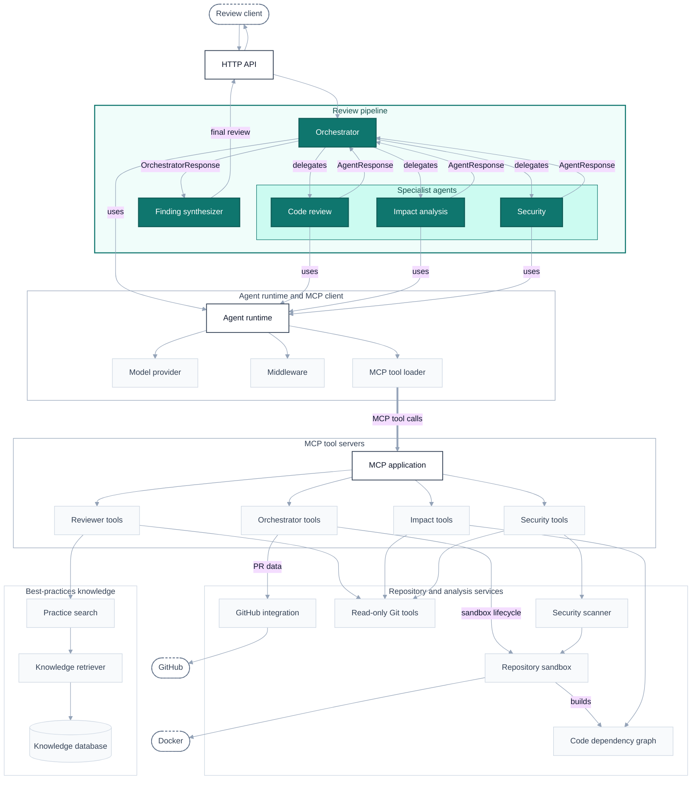

# Pull Request Review Agent Architecture

```mermaid
%%{init: {"theme": "base", "themeVariables": {"fontFamily": "Inter, Helvetica, Arial, sans-serif", "fontSize": "15px", "lineColor": "#94a3b8", "primaryTextColor": "#0f172a"}, "flowchart": {"curve": "basis", "nodeSpacing": 36, "rankSpacing": 50, "padding": 16}}}%%
flowchart TB
    Client(["Review client"]) --> HTTP["HTTP API"]
    HTTP --> Orch

    subgraph PIPE["Review pipeline"]
        direction TB
        Orch["Orchestrator"]

        subgraph SPEC["Specialist agents"]
            direction LR
            CR["Code review"]
            IM["Impact analysis"]
            SEC["Security"]
        end

        Synth["Finding synthesizer"]

        Orch -->|delegates| CR
        Orch -->|delegates| IM
        Orch -->|delegates| SEC

        CR -->|AgentResponse| Orch
        IM -->|AgentResponse| Orch
        SEC -->|AgentResponse| Orch
        Orch -->|OrchestratorResponse| Synth
    end

    subgraph RUN["Agent runtime and MCP client"]
        direction TB
        Runtime["Agent runtime"]
        Model["Model provider"]
        Middleware["Middleware"]
        Loader["MCP tool loader"]

        Runtime --> Model
        Runtime --> Middleware
        Runtime --> Loader
    end

    Orch -->|uses| Runtime
    CR -->|uses| Runtime
    IM -->|uses| Runtime
    SEC -->|uses| Runtime

    subgraph TOOLS["MCP tool servers"]
        direction TB
        MCPApp["MCP application"]
        OrchT["Orchestrator tools"]
        RevT["Reviewer tools"]
        ImpT["Impact tools"]
        SecT["Security tools"]

        MCPApp --> OrchT
        MCPApp --> RevT
        MCPApp --> ImpT
        MCPApp --> SecT
    end

    Loader ==>|MCP tool calls| MCPApp

    subgraph REPO["Repository and analysis services"]
        direction TB
        GHC["GitHub integration"]
        Sandbox["Repository sandbox"]
        GitT["Read-only Git tools"]
        Graph["Code dependency graph"]
        Scanner["Security scanner"]
    end

    subgraph KNOW["Best-practices knowledge"]
        direction TB
        Search["Practice search"]
        Retriever["Knowledge retriever"]
        DB[("Knowledge database")]

        Search --> Retriever
        Retriever --> DB
    end

    OrchT -->|PR data| GHC
    OrchT -->|sandbox lifecycle| Sandbox
    Sandbox -->|builds| Graph

    RevT --> GitT
    RevT --> Search
    ImpT --> GitT
    ImpT --> Graph
    SecT --> GitT
    SecT --> Scanner
    Scanner --> Sandbox

    GitHub(["GitHub"])
    Docker(["Docker"])
    GHC --> GitHub
    Sandbox --> Docker

    Synth -->|final review| HTTP
    HTTP --> Client

    classDef hero fill:#0f766e,stroke:#115e59,stroke-width:2px,color:#ffffff
    classDef core fill:#ffffff,stroke:#334155,stroke-width:1.5px,color:#0f172a
    classDef quiet fill:#f8fafc,stroke:#cbd5e1,stroke-width:1px,color:#334155
    classDef ext fill:#ffffff,stroke:#64748b,stroke-width:1.5px,stroke-dasharray:4 3,color:#334155

    class Orch,Synth,CR,IM,SEC hero
    class HTTP,Runtime,MCPApp core
    class Model,Middleware,Loader,OrchT,RevT,ImpT,SecT,GHC,Sandbox,GitT,Graph,Scanner,Search,Retriever,DB quiet
    class Client,GitHub,Docker ext

    style PIPE fill:#f0fdfa,stroke:#0f766e,stroke-width:2px,color:#134e4a
    style SPEC fill:#ccfbf1,stroke:#0f766e,stroke-width:1px,color:#134e4a
    style RUN fill:#ffffff,stroke:#94a3b8,stroke-width:1px,color:#334155
    style TOOLS fill:#ffffff,stroke:#94a3b8,stroke-width:1px,color:#334155
    style REPO fill:#ffffff,stroke:#cbd5e1,stroke-width:1px,color:#334155
    style KNOW fill:#ffffff,stroke:#cbd5e1,stroke-width:1px,color:#334155
```
